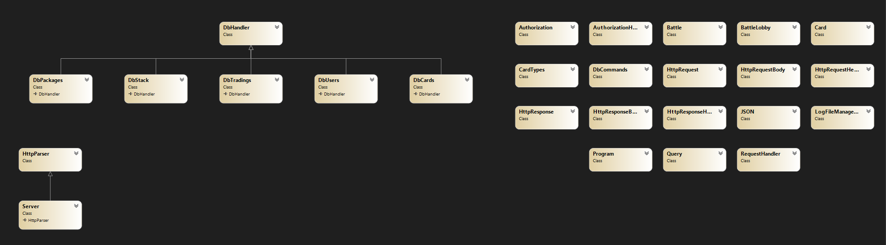

# MonsterTradingCardsGame

This Game was part of a uni project. It is an API written in C#.
   

 
# Design
#### Class diagram

   

# Lessons Learned
- plan ahead before starting 
- think about the structure, design, and requirements of the program more thoroughly 
- encapsulate everything in seperate methods instead of having massive functions
- unit tests are helpful
   

# Unit Testing Decisions
- importance in functionality (Routing, HTTP-Parsing)
- importance in user experience (Battle damage calculation, Trading, Creating cards...)
   

# Unique Feature
User can only try to login 3 times. After 3 failed logins the user gets banned permanently. 
   

# Tracked Time
Time was tracked by writing it in the commit messages
Actual tracked time: 77,21 hours
Estimated time not tracked: 20 hours
Total time: 97,21 hours

# Todos

- User:
    - DONE DONE user registration
    - DONE DONE user login
    - DONE DONE show user data
    - DONE DONE edit user data
    - DONE DONE stats: 1 user
    - DONE DONE scoreboard: all users
    - DONE DONE state management (tokens unso)
- Packages + Stack:
    - DONE DONE create/add packages
    - DONE DONE aquire packages
- Stack:
    - DONE show stack (all acquired cards)
- Deck:
    - Check if Deck with same config alr there before assigning
    - DONE DONE show deck
    - DONE DONE configure deck (delete when error in the middle)
- Battle
    - DONE DONE ELO bekommen
    - DONE DONE User info bekommen
    - DONE DONE Battle starten und response zurückgeben
    - DONE DONE ELO nachm battle
- Trade:
    - DONE DONE Trade (stack funktionen myb in DbStack?)
    - DONE DONE check trading deals
    - DONE DONE create trading deals
    - DONE DONE delete trading deals
- DONE DONE Authorization
- DONE DONE Card+Monster type

- Errors:
    DONE Package already exists
    DONE Better error msg on 14)
    DONE Invalid request being printed twice?

    dragon 50 fire monster vs waterspell 20 water spell => waterspell won
